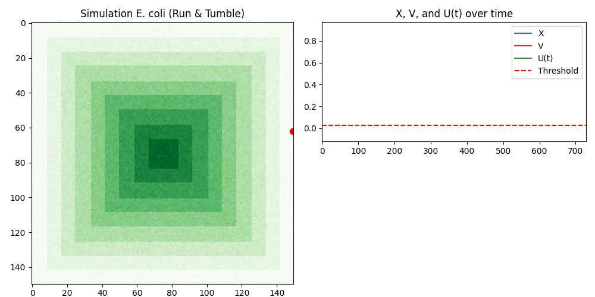
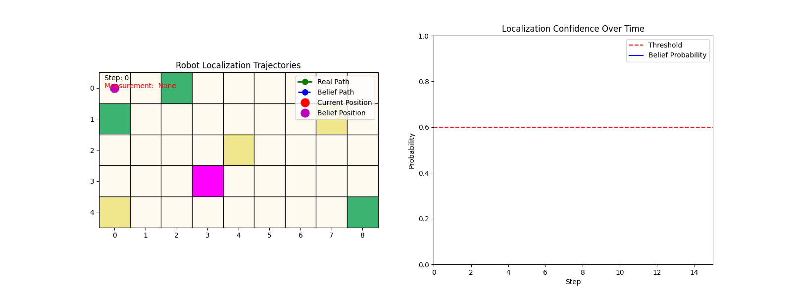

# Intelligent Robotics

This repository contains the work for the Intelligent Robotics course in the ISI program at UASLP.

# Content
The repository is organized by partials and includes:

In each partial we work with micropython to control Lego Ev3 and we use python to make simulations.

### **Partial 1**
- **Interaction With Environment**
- **Robotic Architectures**

We simulate the chemotactic behavior of E. coli, using a **leaky integrator** to make a reactive robot.

The simulation environment is created using iris sheets in five shades of green, representing different attractant concentrations. Attractant concentration values are captured using the robot's color sensor.

Each time the robot measures the attractant concentration, it updates its internal state \( V(t) \) using the differential equation:

$$
    \frac{dV(t)}{dt} + aV(t) = bX(t)
$$

Then, the robot's behavior is determined by comparing the difference \( U(t) = X(t) - V(t) \) with a predefined threshold.

  
  
Simulation of bacterial behavior algorithm (Reactive Robot)

  
  
Lego EV3 robot executing the algorithm

### **Partial 2**
- **Perception And Localization**

We implemented Markov Localization to estimate the robot's position on a known map with unknown initial location. By updating a belief distribution based on sensor readings and movements, the robot gradually converges to its true position. The method was tested both in simulation and on a Lego EV3 robot using colored landmarks as references.

  
  
Simulation of Marko's Localization algorithm

  
  
Lego EV3 robot executing the algorithm

### **Parcial 3**
- **Motion Planning**
- **Decision Making**

# Requirements
